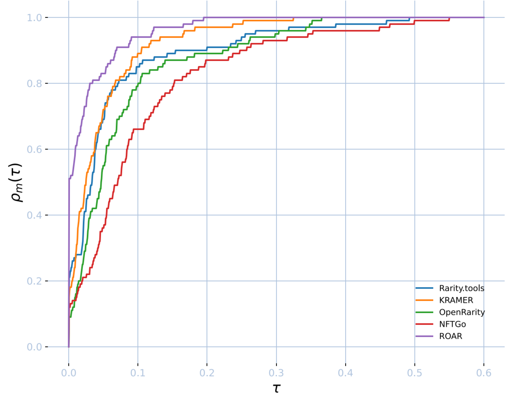

# ROAR

A Benchmark for NFT Rarity Meters.


## Installation

```console
# Clone a repo
git clone https://github.com/fasghq/ROAR-benchmark.git

# Create virtual envoronment and install required packages
python3 -m venv roar-venv
source roar-venv/bin/activate
pip3 install -r requirements.txt
```

## Verification of rarity meters implementations

As part of our benchmark showcase, we also performed a set of verification experiments to ensure the accuracy of our implementation.
Custom implementations of `OpenRarity`, `rarity.tools`, `NFTGo` and `Kramer` can be found in the `performance_evaluation` directory. 

The command for running verification tests:

```console
python -m pytest examples
```

## Results

To visualize the comparison of rarity meters on the entire dataset, we use **performance profiles**.

Assume we have $C$ NFT collections: $\mathbb{X}^1, \ldots, \mathbb{X}^C$. Denote the performance measure of m-th rarity meter $R_m$
on c-th collection $\mathbb{X}^c$ as $F_{m, c} = F(R_m; \mathbb{X}^c)$. 

Then, **performance profile** of rarity meter $R_m$ in a rarity meter set $R_1, \ldots, R_m$ on ROAR benchmark is defined as:

$$
\rho(\tau; R_m) = \dfrac{1}{C} \sum \limits_{c = 1}^{C} \[ F_{m, c} + \tau \geq \max{ \( F_{i, c} \) }_{i = 1}^{M} \]
$$

The results can be seen on the graph below:




## Citation

TODO
